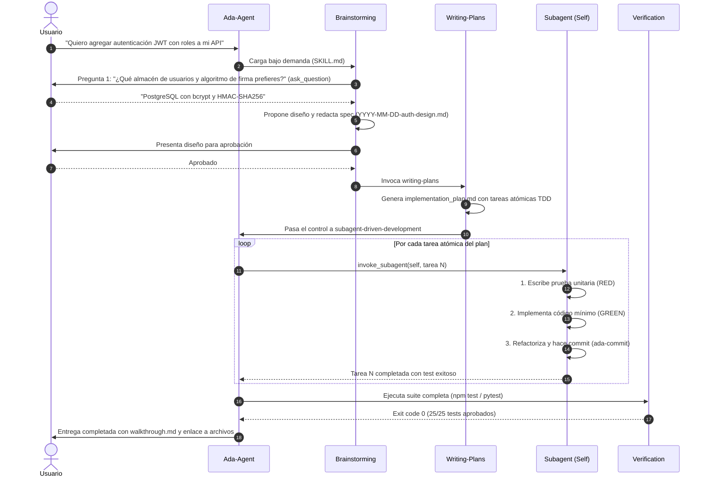

# Ada Aider

**Ada-Aider** es un sistema agente unificado, modular y de máxima eficiencia en el consumo de tokens diseñado para asistentes de codificación con Inteligencia Artificial (Google Antigravity, Claude Code, Cursor, Windsurf y agentes basados en Gemini / Claude). Su nombre rinde homenaje a **Ada Lovelace**, la matemática británica pionera reconocida universalmente como la primera programadora de computadoras de la historia.

El sistema fusiona la **disciplina procedimental estricta de Superpowers** (diseño paso a paso con hard-gates, planificación atómica, TDD riguroso, depuración basada en evidencia, subagentes aislados y verificación empírica) con las **habilidades de dominio e ingeniería avanzada de Ada** (diseño UI/UX premium, bases de datos SQL, seguridad y auditoría de secretos, MCP, telemetría, hardware/firmware, academia y ciencias de la ingeniería) y una **arquitectura de ahorro de tokens** de alto rendimiento.

---

> [!IMPORTANT]
> **Filosofía Operativa Central**:
> Ada-Aider opera bajo la regla de **"Habilidades antes de la acción"**. Ante cualquier solicitud, el agente consulta su enrutador de habilidades (`GEMINI.md`), carga bajo demanda (*lazy loading*) el archivo de instrucciones correspondiente y ejecuta el flujo paso a paso sin suposiciones ni afirmaciones especulativas.

---

## 📑 Tabla de Contenidos

1. [Arquitectura General y Ahorro de Tokens](#-arquitectura-general-y-ahorro-de-tokens)
2. [Cómo se Ejecutan las Habilidades en Ada-Aider](#-cómo-se-ejecutan-las-habilidades-en-ada-aider)
   - [Mecanismo de Invocación y Lazy Loading](#1-mecanismo-de-invocación-y-lazy-loading)
   - [Mapeo de Herramientas CLI (Antigravity & Claude Code)](#2-mapeo-de-herramientas-cli-antigravity--claude-code)
   - [Aislamiento por Subagentes Dedicados](#3-aislamiento-por-subagentes-dedicados)
   - [Directivas de Eficiencia y Guardrails Anti-Relleno](#4-directivas-de-eficiencia-y-guardrails-anti-relleno)
3. [Catálogo Exhaustivo de Habilidades (52 Skills)](#-catálogo-exhaustivo-de-habilidades-52-skills)
   - [A. Habilidades de Proceso Central (Superpowers Engine - 14 Skills)](#a-habilidades-de-proceso-central-superpowers-engine---14-skills)
   - [B. Habilidades Puente y Enrutamiento Maestro (Ada Bridges - 8 Skills)](#b-habilidades-puente-y-enrutamiento-maestro-ada-bridges---8-skills)
   - [C. Habilidades de Dominio y Automatización (Ada System - 12 Skills)](#c-habilidades-de-dominio-y-automatización-ada-system---12-skills)
   - [D. Habilidades Académicas, Investigación e Ingeniería (Ada Suite - 18 Skills)](#d-habilidades-académicas-investigación-e-ingeniería-ada-suite---18-skills)
4. [Flujos de Trabajo Prácticos de Extremo a Extremo](#-flujos-de-trabajo-prácticos-de-extremo-a-extremo)
   - [Flujo 1: Desarrollo de Nueva Característica con TDD y Subagentes](#flujo-1-desarrollo-de-nueva-característica-con-tdd-y-subagentes)
   - [Flujo 2: Depuración Sistemática de un Error en Producción](#flujo-2-depuración-sistemática-de-un-error-en-producción)
   - [Flujo 3: Lanzamiento Automatizado y Semantic Versioning](#flujo-3-lanzamiento-automatizado-y-semantic-versioning)
5. [Estructura del Repositorio](#-estructura-del-repositorio)
6. [Instalación y Configuración](#-instalación-y-configuración)
7. [Comandos Slash y Modos de Compresión (Caveman Mode)](#-comandos-slash-y-modos-de-compresión-caveman-mode)
8. [Verificación y Pruebas Automatizadas](#-verificación-y-pruebas-automatizadas)
9. [Licencia y Créditos](#-licencia-y-créditos)

---

## ⚡ Arquitectura General y Ahorro de Tokens

En los entornos tradicionales de agentes de IA, todas las instrucciones de todas las herramientas y guías se inyectan en el prompt inicial del sistema, provocando:
- Consumo masivo de **Input Tokens** (15,000 - 40,000 tokens por turno).
- Degradación de la atención del modelo (*Lost in the Middle*).
- Mayor latencia de respuesta y costos elevados.

Ada-Aider resuelve esto mediante una **Arquitectura de Enrutamiento Dinámico con Carga Bajo Demanda (Lazy-Loading)**:

```
                  ┌──────────────────────────────────────────────┐
                  │          Petición del Usuario / CLI          │
                  └──────────────────────┬───────────────────────┘
                                         │
                                         ▼
                  ┌──────────────────────────────────────────────┐
                  │    GEMINI.md (Router Maestro Compacto)       │
                  │   ~60 líneas / Tabla de Despacho Dinámica    │
                  └──────────────────────┬───────────────────────┘
                                         │
                   Dispara la lectura bajo demanda (view_file)
                                         │
                 ┌───────────────────────┴───────────────────────┐
                 ▼                                               ▼
┌─────────────────────────────────┐             ┌─────────────────────────────────┐
│ Habilidades de Proceso          │             │ Habilidades Especializadas      │
│ (brainstorming, writing-plans,  │             │ (ada-taste, ada-db, ada-ai,     │
│  test-driven-development, etc.) │             │  ada-os, ada-security, etc.)    │
└─────────────────────────────────┘             └─────────────────────────────────┘
```

### Resultados de Eficiencia:
- **Reducción del 65% al 85% de tokens de entrada** en cada interacción.
- **Cero código re-impreso en el chat**: Las ediciones se guardan directamente en archivos y en el chat solo se envía un enlace navegable `[archivo.ts](file:///...)`.
- **Cero resumen redundante de artefactos**: Los planes (`implementation_plan.md`) y walkthroughs (`walkthrough.md`) se persisten como artefactos nativos en disco sin duplicar su contenido en la conversación.

---

## 🛠️ Cómo se Ejecutan las Habilidades en Ada-Aider

### 1. Mecanismo de Invocación y Lazy Loading

Las habilidades no son scripts opacos ejecutados a ciegas; son **protocolos de ejecución estructurados** que guían el comportamiento del modelo de IA paso a paso:

1. **Detección de Intención**: El agente analiza la tarea actual frente a la tabla de enrutamiento en [GEMINI.md](GEMINI.md) o [skills/ada-agent/SKILL.md](skills/ada-agent/SKILL.md).
2. **Lectura Obligatoria de la Habilidad (`view_file`)**: Antes de emitir cualquier respuesta o tocar código, el agente lee el archivo `SKILL.md` de la habilidad respectiva.
3. **Anuncio de Ejecución**: El agente anuncia formalmente: `Using [nombre-skill] to [propósito]`.
4. **Ejecución Guiada por Tareas**: Si la habilidad define una lista de verificación (*checklist*), el agente crea tareas atómicas y las completa secuencialmente.
5. **Cierre y Verificación**: La habilidad culmina con evidencia empírica (ej. salida de pruebas con `exit code 0`) antes de declarar la tarea terminada.

### 2. Mapeo de Herramientas CLI (Antigravity & Claude Code)

Cada acción descrita en los protocolos de las habilidades se ejecuta utilizando las herramientas nativas del entorno:

| Acción Requerida por la Habilidad | Herramienta Antigravity | Herramienta Claude Code | Propósito |
| :--- | :--- | :--- | :--- |
| **Leer archivos o guías** | `view_file` | `View` / `Read` | Cargar código fuente o instrucciones `SKILL.md`. |
| **Crear nuevos archivos o artefactos** | `write_to_file` | `Write` | Generar módulos, planes (`implementation_plan.md`) o especificaciones. |
| **Modificar código existente** | `replace_file_content` / `multi_replace_file_content` | `Edit` | Ediciones atómicas quirúrgicas sin reescribir archivos enteros. |
| **Ejecutar comandos en terminal** | `run_command` | `Bash` | Ejecutar suites de pruebas (`npm test`, `pytest`), linters y compiladores. |
| **Búsqueda exacta de patrones / secretos** | `grep_search` | `Grep` | Localizar funciones, variables o auditar fugas de credenciales. |
| **Desplegar subagentes aislados** | `invoke_subagent` (`self` / `research`) | `Agent` | Delegar tareas en sub-contextos independientes. |
| **Formular preguntas interactivas** | `ask_question` | `AskUserQuestion` | Presentar menús de opciones múltiples para decisiones de diseño. |
| **Generar imágenes / activos UI** | `generate_image` | N/A | Crear mockups, logotipos e imágenes reales para interfaces. |

### 3. Aislamiento por Subagentes Dedicados

Para tareas complejas de múltiples pasos (como la ejecución de un plan de 10 tareas):
- El agente orquestador (`ada-agent` / `subagent-driven-development`) **no contamina** la ventana de chat principal.
- Por cada tarea, invoca un subagente dedicado con `invoke_subagent`:
  - **`TypeName: "research"`**: Subagente de solo lectura para explorar bases de código grandes y documentaciones.
  - **`TypeName: "self"`**: Subagente con capacidades completas de lectura, escritura y ejecución de comandos para implementar una tarea atómica con TDD.
- El subagente implementa la tarea, corre las pruebas, realiza el commit y reporta el resultado al agente principal, quien revisa el código antes de pasar a la siguiente tarea.

### 4. Directivas de Eficiencia y Guardrails Anti-Relleno

- **Prohibición de Texto de Relleno**: Sin saludos vacíos (*"¡Hola! Claro, con gusto te ayudo..."*).
- **Prohibición de Afirmaciones Especulativas**: Queda estrictamente prohibido decir *"debería funcionar"*, *"el cambio está listo"* o *"la prueba pasará"* sin haber ejecutado la prueba en terminal y verificado su código de salida.
- **Red Flags Anti-Racionalización**: Pensamientos como *"es un cambio muy simple, no necesito hacer pruebas"* o *"primero escribiré el código y luego el test"* disparan un alto inmediato en el flujo del agente.

---

## 📚 Catálogo Exhaustivo de Habilidades (52 Skills)

A continuación se detalla **cada una de las 52 habilidades del sistema**, especificando:
- **Propósito**: Qué problema resuelve y cuándo aplica.
- **Cómo se Ejecuta**: Flujo paso a paso, herramientas involucradas y comandos.
- **Entradas y Salidas**: Archivos leídos, artefactos generados y pruebas ejecutadas.
- **Ejemplo Canónico**: Ejemplo de invocación o código.

---

### A. Habilidades de Proceso Central (Superpowers Engine - 14 Skills)

#### 1. `using-superpowers`
- **Ubicación**: [skills/using-superpowers/SKILL.md](skills/using-superpowers/SKILL.md)
- **Propósito**: Regla maestra y guardián de entrada del sistema. Establece la obligación estricta de invocar habilidades relevantes *antes* de cualquier acción, exploración o respuesta.
- **Cómo se Ejecuta**:
  1. Se evalúa al inicio de cada turno.
  2. Si la tarea implica diseño, delega a `brainstorming`; si implica error, delega a `systematic-debugging`.
  3. Contiene la tabla de 12 *Red Flags* (trampas cognitivas donde el modelo intenta saltarse los procesos) para forzar la disciplina.
- **Salida**: Anuncio formal de la habilidad seleccionada y cambio de comportamiento.
- **Ejemplo**: *"Using using-superpowers to evaluate required workflows for user prompt."*

#### 2. `brainstorming`
- **Ubicación**: [skills/brainstorming/SKILL.md](skills/brainstorming/SKILL.md)
- **Propósito**: Descubrimiento colaborativo de requisitos y diseño arquitectónico antes de escribir código (`<HARD-GATE>`).
- **Cómo se Ejecuta**:
  1. Explora el contexto actual del repositorio (`view_file`, `list_dir`).
  2. Formula preguntas aclaratorias estructuradas **una a la vez** (usando `ask_question`).
  3. Propone 2-3 enfoques arquitectónicos con sus ventajas, desventajas y recomendación explícita.
  4. Presenta el diseño en secciones modulares y solicita aprobación del usuario tras cada sección.
  5. Escribe la especificación validada en `docs/superpowers/specs/YYYY-MM-DD-<topic>-design.md`.
  6. Ejecuta una auto-revisión de la especificación (eliminando TODOs, ambigüedades y contradicciones).
  7. Invoca obligatoriamente `writing-plans` como estado terminal.
- **Salida**: Documento de especificación `docs/superpowers/specs/...-design.md` aprobado y commiteado.

#### 3. `writing-plans`
- **Ubicación**: [skills/writing-plans/SKILL.md](skills/writing-plans/SKILL.md)
- **Propósito**: Transformar una especificación de diseño aprobada en un plan de implementación detallado, compuesto por tareas atómicas e independientes (de 2 a 5 minutos cada una).
- **Cómo se Ejecuta**:
  1. Lee la especificación y define la estructura de archivos afectados.
  2. Desglosa la solución en tareas atómicas con granularidad TDD:
     - Paso 1: Escribir prueba que falla.
     - Paso 2: Ejecutar prueba y verificar que falla.
     - Paso 3: Escribir código mínimo para que pase.
     - Paso 4: Ejecutar prueba y verificar que pasa.
     - Paso 5: Commit atómico en Git.
  3. Define bloques explícitos de `Interfaces: Consumes / Produces` con firmas y tipos exactos (sin placeholders como "TODO" o "implementar luego").
  4. Guarda el plan en `docs/superpowers/plans/YYYY-MM-DD-<feature>.md` o en el artefacto `implementation_plan.md`.
  5. Ofrece al usuario elegir entre ejecución por subagentes (`subagent-driven-development`) o en línea (`executing-plans`).
- **Salida**: Archivo de plan ejecutable con tareas en formato de casillas de verificación `- [ ]`.

#### 4. `executing-plans`
- **Ubicación**: [skills/executing-plans/SKILL.md](skills/executing-plans/SKILL.md)
- **Propósito**: Ejecutar un plan de implementación en la sesión principal mediante lotes de tareas con puntos de control de revisión (*checkpoints*).
- **Cómo se Ejecuta**:
  1. Carga el plan de implementación desde el disco.
  2. Itera tarea por tarea: ejecuta los pasos TDD de la tarea actual.
  3. Ejecuta las pruebas correspondientes y verifica el resultado.
  4. Realiza el commit correspondiente y marca la tarea como completada (`- [x]`).
  5. Solicita retroalimentación del usuario en los puntos de control definidos.
- **Salida**: Código implementado y plan actualizado con tareas completadas.

#### 5. `subagent-driven-development`
- **Ubicación**: [skills/subagent-driven-development/SKILL.md](skills/subagent-driven-development/SKILL.md)
- **Propósito**: Implementar planes de desarrollo asignando cada tarea atómica a un subagente independiente con contexto limpio, realizando revisiones de dos etapas por cada tarea.
- **Cómo se Ejecuta**:
  1. El agente coordinador lee el plan de tareas.
  2. Para cada tarea:
     - Despacha un subagente `self` mediante `invoke_subagent` con la descripción exacta de la tarea, archivos a tocar e interfaces.
     - El subagente implementa la tarea siguiendo TDD (escribe test, falla, implementa, pasa test) y realiza el commit.
     - El coordinador despacha un subagente de revisión (`spec review` y `code review`) para auditar la calidad y apego a la especificación.
     - Si hay objeciones, el subagente corrige; si está aprobado, se avanza a la siguiente tarea.
- **Salida**: Código verificado, historial de commits limpio y ventana de chat principal con bajo uso de tokens.

#### 6. `test-driven-development`
- **Ubicación**: [skills/test-driven-development/SKILL.md](skills/test-driven-development/SKILL.md)
- **Propósito**: Garantizar la máxima calidad y cobertura del software obligando al ciclo estricto **RED-GREEN-REFACTOR**.
- **Cómo se Ejecuta**:
  1. **RED**: Escribir una prueba unitaria o de integración enfocada en el comportamiento deseado.
  2. **Verificar Fallo**: Ejecutar la suite de pruebas (`run_command`) y confirmar que falla exactamente por la razón esperada (ej. `AssertionError` o función no definida).
  3. **GREEN**: Escribir la mínima cantidad de código de producción necesario para que la prueba pase.
  4. **Verificar Éxito**: Ejecutar la prueba y confirmar salida exitosa (`exit code 0`).
  5. **REFACTOR**: Limpiar el código manteniendo todas las pruebas en verde.
- **Salida**: Código libre de regresiones respaldado por suites de pruebas automatizadas.

#### 7. `systematic-debugging`
- **Ubicación**: [skills/systematic-debugging/SKILL.md](skills/systematic-debugging/SKILL.md)
- **Propósito**: Resolver bugs, fallos de pruebas o comportamientos inesperados mediante un proceso de 5 fases basado en evidencia, erradicando los parches sintomáticos o conjeturas.
- **Cómo se Ejecuta**:
  1. **Reproducción Confiable**: Diseñar un caso de prueba mínimo que reproduzca el error de forma determinista.
  2. **Aislamiento de Causa Raíz**: Examinar logs, trazas de pila y cambios recientes para identificar el punto exacto de falla.
  3. **Creación de Test Reproductor**: Escribir una prueba automatizada que falle demostrando el bug.
  4. **Corrección Mínima de Causa Raíz**: Corregir el defecto fundamental (no tapar síntomas).
  5. **Verificación Empírica**: Correr toda la suite de pruebas para certificar que el bug se solucionó y no se introdujeron regresiones.
- **Salida**: Test de regresión agregado y corrección verificada.

#### 8. `verification-before-completion`
- **Ubicación**: [skills/verification-before-completion/SKILL.md](skills/verification-before-completion/SKILL.md)
- **Propósito**: Barrera de finalización obligatoria. Prohíbe declarar tareas como completadas sin evidencia empírica fresca de la terminal.
- **Cómo se Ejecuta**:
  1. Identifica los comandos de prueba/compilación del proyecto (`npm test`, `pytest`, `cargo test`, `go test`, `tsc --noEmit`).
  2. Ejecuta el comando en la terminal con `run_command`.
  3. Inspecciona la salida completa y el código de retorno.
  4. Solo si `exit code == 0`, reporta formalmente la finalización indicando el número exacto de pruebas aprobadas.
- **Salida**: Confirmación basada en evidencia con métricas reales de ejecución.

#### 9. `using-git-worktrees`
- **Ubicación**: [skills/using-git-worktrees/SKILL.md](skills/using-git-worktrees/SKILL.md)
- **Propósito**: Aislar desarrollos de nuevas características o experimentos en directorios y ramas independientes de Git sin alterar el directorio de trabajo principal.
- **Cómo se Ejecuta**:
  1. Verifica el estado del repositorio (`git status`).
  2. Crea un worktree aislado: `git worktree add -b feature/nueva-rama .worktrees/nueva-rama main`.
  3. Configura dependencias e inicializa el entorno dentro del worktree.
  4. Ejecuta el desarrollo dentro de dicho directorio aislado.
- **Salida**: Directorio de trabajo aislado y rama creada.

#### 10. `requesting-code-review`
- **Ubicación**: [skills/requesting-code-review/SKILL.md](skills/requesting-code-review/SKILL.md)
- **Propósito**: Estructurar solicitudes formales de revisión de código antes de integrar cambios en ramas principales o enviar Pull Requests.
- **Cómo se Ejecuta**:
  1. Ejecuta una auto-revisión previa del diff (`git diff main...HEAD`).
  2. Redacta el resumen de cambios, contexto de la decisión arquitectónica, evidencia de pruebas ejecutadas y evaluación de riesgos.
  3. Presenta la solicitud al revisor (humano o subagente especializado).
- **Salida**: Documento o mensaje estructurado de solicitud de revisión.

#### 11. `receiving-code-review`
- **Ubicación**: [skills/receiving-code-review/SKILL.md](skills/receiving-code-review/SKILL.md)
- **Propósito**: Procesar comentarios de revisión de código con rigor técnico, eliminando la condescendencia o la aceptación ciega de sugerencias defectuosas.
- **Cómo se Ejecuta**:
  1. Analiza cada comentario de revisión de forma individual.
  2. Verifica técnicamente la validez del comentario (comprobando código y pruebas).
  3. Si la sugerencia es correcta, aplica la corrección con TDD.
  4. Si la sugerencia introduce un error o contradicción, presenta cortésmente la evidencia técnica que lo justifica.
- **Salida**: Cambios corregidos o aclaraciones fundamentadas con datos y pruebas.

#### 12. `finishing-a-development-branch`
- **Ubicación**: [skills/finishing-a-development-branch/SKILL.md](skills/finishing-a-development-branch/SKILL.md)
- **Propósito**: Cerrar ordenadamente una rama de desarrollo tras completar todas las tareas y pruebas.
- **Cómo se Ejecuta**:
  1. Verifica que no existan cambios sin commitear y que todos los tests pasen (`exit code 0`).
  2. Determina el método de integración (Merge, Squash & Merge o Rebase).
  3. Ejecuta la integración o prepara el Pull Request.
  4. Elimina los worktrees temporales (`git worktree remove`) y limpia las ramas locales si corresponde.
- **Salida**: Rama integrada y entorno de trabajo limpio.

#### 13. `dispatching-parallel-agents`
- **Ubicación**: [skills/dispatching-parallel-agents/SKILL.md](skills/dispatching-parallel-agents/SKILL.md)
- **Propósito**: Ejecutar múltiples tareas independientes en paralelo cuando no existen dependencias de estado o bloqueos mutuos.
- **Cómo se Ejecuta**:
  1. Identifica las tareas completamente ortogonales del plan.
  2. Despacha múltiples llamadas simultáneas a `invoke_subagent`.
  3. Monitorea las notificaciones reactivas del sistema conforme cada subagente completa su tarea.
  4. Consolida y revisa los resultados de todos los subagentes.
- **Salida**: Ejecución concurrente acelerada de tareas independientes.

#### 14. `writing-skills`
- **Ubicación**: [skills/writing-skills/SKILL.md](skills/writing-skills/SKILL.md)
- **Propósito**: Meta-habilidad para diseñar, redactar, validar y desplegar nuevas habilidades dentro del ecosistema Ada-Aider siguiendo los estándares de YAML frontmatter y esquemas de ejecución.
- **Cómo se Ejecuta**:
  1. Define el nombre, descripción y disparadores de la nueva habilidad.
  2. Redacta el archivo `SKILL.md` con frontmatter estructurado, directivas claras, checklists y ejemplos canónicos.
  3. Añade la entrada correspondiente en el enrutador [GEMINI.md](GEMINI.md).
  4. Ejecuta pruebas de validación para certificar que el agente la cargue e interprete correctamente.
- **Salida**: Nueva habilidad lista para ser consumida bajo demanda.

---

### B. Habilidades Puente y Enrutamiento Maestro (Ada Bridges - 8 Skills)

#### 15. `ada-agent`
- **Ubicación**: [skills/ada-agent/SKILL.md](skills/ada-agent/SKILL.md)
- **Propósito**: Orquestador maestro del sistema Ada. Coordina los guardrails de proceso, el sistema de compresión conversacional (*Caveman Mode*), el mapeo de herramientas CLI de Antigravity/Claude Code y las directivas de protección de presupuesto de contexto.
- **Cómo se Ejecuta**:
  1. Se evalúa en la sesión activa y aplica los 5 pasos obligatorios: Brainstorm -> Plan -> Execute -> TDD -> Verify -> Release.
  2. Controla la compresión de texto en chat (`/ada [lite|full|ultra|off]`).
  3. Hace cumplir las reglas de "Cero duplicación de código en chat" y "Cero re-resumen de artefactos".
- **Salida**: Comportamiento disciplinado, eficiente y estructurado en todas las respuestas.

#### 16. `ada-brainstorm`
- **Ubicación**: [skills/ada-brainstorm/SKILL.md](skills/ada-brainstorm/SKILL.md)
- **Propósito**: Puente semántico que enruta las solicitudes de lluvia de ideas y diseño inicial directamente a `brainstorming`.
- **Cómo se Ejecuta**: Delega de forma transparente a [skills/brainstorming/SKILL.md](skills/brainstorming/SKILL.md).

#### 17. `ada-plan`
- **Ubicación**: [skills/ada-plan/SKILL.md](skills/ada-plan/SKILL.md)
- **Propósito**: Puente semántico que enruta la redacción y ejecución de planes atómicos a `writing-plans` y `executing-plans`.
- **Cómo se Ejecuta**: Delega de forma transparente a [skills/writing-plans/SKILL.md](skills/writing-plans/SKILL.md) y [skills/executing-plans/SKILL.md](skills/executing-plans/SKILL.md).

#### 18. `ada-code`
- **Ubicación**: [skills/ada-code/SKILL.md](skills/ada-code/SKILL.md)
- **Propósito**: Puente semántico para la fase de implementación de código, haciendo cumplir el ciclo de desarrollo guiado por pruebas (`test-driven-development`).
- **Cómo se Ejecuta**: Delega de forma transparente a [skills/test-driven-development/SKILL.md](skills/test-driven-development/SKILL.md).

#### 19. `ada-verify`
- **Ubicación**: [skills/ada-verify/SKILL.md](skills/ada-verify/SKILL.md)
- **Propósito**: Puente semántico hacia la verificación empírica obligatoria antes de declarar cualquier trabajo como finalizado (`verification-before-completion`).
- **Cómo se Ejecuta**: Delega de forma transparente a [skills/verification-before-completion/SKILL.md](skills/verification-before-completion/SKILL.md).

#### 20. `ada-debug`
- **Ubicación**: [skills/ada-debug/SKILL.md](skills/ada-debug/SKILL.md)
- **Propósito**: Puente semántico para la investigación metódica de fallos y errores hacia `systematic-debugging`.
- **Cómo se Ejecuta**: Delega de forma transparente a [skills/systematic-debugging/SKILL.md](skills/systematic-debugging/SKILL.md).

#### 21. `ada-review`
- **Ubicación**: [skills/ada-review/SKILL.md](skills/ada-review/SKILL.md)
- **Propósito**: Puente semántico para las revisiones de código, enrutando a `requesting-code-review` y `receiving-code-review`.
- **Cómo se Ejecuta**: Delega de forma transparente a los flujos de code review de Superpowers.

#### 22. `ada-workflow`
- **Ubicación**: [skills/ada-workflow/SKILL.md](skills/ada-workflow/SKILL.md)
- **Propósito**: Auditoría y descubrimiento profundo de proyectos recién abiertos o existentes. Analiza herramientas de construcción, manejadores de paquetes, frameworks de prueba, linters y scripts de despliegue.
- **Cómo se Ejecuta**:
  1. Examina archivos de configuración raíz (`package.json`, `Cargo.toml`, `pyproject.toml`, `go.mod`, `Makefile`, etc.).
  2. Detecta comandos estándar para: test, build, lint, dev y release.
  3. Genera una especificación de flujo de trabajo `project-workflow.md` para que todos los subagentes conozcan las herramientas exactas del repositorio.
- **Salida**: Archivo `project-workflow.md` documentando las herramientas y comandos del proyecto.

---

### C. Habilidades de Dominio y Automatización (Ada System - 12 Skills)

#### 23. `ada-taste`
- **Ubicación**: [skills/ada-taste/SKILL.md](skills/ada-taste/SKILL.md)
- **Propósito**: Directrices de diseño UI/UX frontend de nivel premium (*anti-slop*). Erradica interfaces genéricas, botones planos sin estados y diseños anticuados.
- **Cómo se Ejecuta**:
  1. Aplica paletas cromáticas ricas en HSL/HEX con modos oscuros refinados (ej. fondos `#0f172a`, acentos luminosos).
  2. Importa fuentes modernas de Google Fonts (Inter, Roboto, Outfit, Plus Jakarta Sans) en HTML/CSS.
  3. Implementa efectos visuales dinámicos: Glassmorphism (`backdrop-filter: blur(12px)`), sombras elevadas y microinteracciones suaves en `:hover`, `:focus-visible` y `:active`.
  4. Utiliza CSS moderno: CSS Grid, Flexbox, `:has()`, `:user-valid` y variables CSS en `:root`.
  5. **Regla de Cero Placeholders**: Prohíbe terminantemente URLs vacías o `via.placeholder.com`; invoca la herramienta `generate_image` para producir activos visuales reales.
- **Salida**: Interfaces modernas, atractivas y accesibles bajo WCAG 2.2 AA.

#### 24. `ada-db`
- **Ubicación**: [skills/ada-db/SKILL.md](skills/ada-db/SKILL.md)
- **Propósito**: Arquitectura de bases de datos, normalización de esquemas relacionales y optimización de consultas SQL.
- **Cómo se Ejecuta**:
  1. Diseña esquemas bajo Tercera Forma Normal (3NF) para OLTP o modelos dimensionales (Star/Snowflake) para OLAP.
  2. Modela entidades visualmente mediante diagramas Mermaid ERD.
  3. Exige que todas las migraciones sean reversibles con scripts simétricos `UP` (aplicar) y `DOWN` (revertir).
  4. Analiza consultas complejas con `EXPLAIN` o `EXPLAIN ANALYZE`, detectando escaneos secuenciales (`Seq Scan`) y agregando índices B-tree/GIN donde corresponda.
  5. Configura pools de conexiones, timeouts explícitos (`statement_timeout`) y transacciones seguras con `COMMIT` y `ROLLBACK`.
- **Salida**: Esquemas robustos, diagramas ERD y migraciones SQL probadas en ambas direcciones.

#### 25. `ada-security`
- **Ubicación**: [skills/ada-security/SKILL.md](skills/ada-security/SKILL.md)
- **Propósito**: Auditoría automatizada de seguridad, escaneo de secretos, sanitización de entradas y prevención de inyecciones.
- **Cómo se Ejecuta**:
  1. Ejecuta búsquedas con `grep_search` para patrones de secretos (`api_key`, `secret`, `password`, `bearer`, `BEGIN PRIVATE KEY`).
  2. Verifica que las claves sensibles se carguen mediante variables de entorno y que `.env*` esté incluido en `.gitignore`.
  3. Comprueba que todas las consultas SQL estén parametrizadas (prohibiendo concatenaciones de strings).
  4. Valida rutas de archivos para evitar vulnerabilidades de *Path Traversal* (`../..`).
  5. Audita dependencias mediante herramientas como `npm audit`, `cargo audit` o `pip audit`.
- **Salida**: Informe de seguridad limpio y mitigación de vulnerabilidades antes de cada commit o release.

#### 26. `ada-mcp`
- **Ubicación**: [skills/ada-mcp/SKILL.md](skills/ada-mcp/SKILL.md)
- **Propósito**: Integración, configuración y consumo de servidores bajo el estándar Model Context Protocol (MCP).
- **Cómo se Ejecuta**:
  1. Descubre herramientas y recursos provistos por servidores MCP registrados en `~/.gemini/config/mcp_config.json`.
  2. Prioriza herramientas estructuradas MCP frente a scripts de shell cuando están disponibles (inspección de bases de datos, navegación de navegadores, trazado de incidencias).
  3. Implementa rutas de degradación elegante (*fallback*) a herramientas nativas de terminal si el servidor MCP no responde o falla.
- **Salida**: Interacción fluida y segura con herramientas externas estandarizadas.

#### 27. `ada-hardware`
- **Ubicación**: [skills/ada-hardware/SKILL.md](skills/ada-hardware/SKILL.md)
- **Propósito**: Desarrollo de firmware embebido en C/C++ (ESP-IDF, Zephyr, FreeRTOS) y diseño RTL sintetizable en Verilog / SystemVerilog / VHDL.
- **Cómo se Ejecuta**:
  1. **Firmware C/C++**:
     - Prohíbe la asignación dinámica en bucles de tiempo de ejecución (`malloc`/`new`), forzando buffers estáticos.
     - Diseña rutinas de interrupción (ISRs) ultra-cortas que encolan eventos en colas seguras (`xQueueSendFromISR`) sin I/O bloqueante.
     - Modela protocolos de comunicación (UART, SPI, I2C, CAN, BLE) como Máquinas de Estados Finitos (FSM).
  2. **Diseño RTL**:
     - Separa lógica combinacional (`always_comb` / `always @(*)`) de lógica secuencial (`always_ff @(posedge clk)`).
     - Integra interfaces estándar de bus (AXI4-Lite, APB).
     - Ejecuta testbenches y simulaciones reproducibles con `iverilog` o `verilator`.
- **Salida**: Firmware robusto sin fragmentación de memoria y módulos RTL verificados por simulación.

#### 28. `ada-telemetry`
- **Ubicación**: [skills/ada-telemetry/SKILL.md](skills/ada-telemetry/SKILL.md)
- **Propósito**: Observabilidad, logging estructurado en formato JSON, instrumentación de errores con Sentry / OpenTelemetry y seguimiento del consumo de tokens y costos LLM.
- **Cómo se Ejecuta**:
  1. Configura loggers estructurados que emiten eventos en JSON con `timestamp`, `level` (INFO, WARN, ERROR), `component` y `trace_id`.
  2. Prohíbe terminantemente bloques `catch` vacíos o excepciones silenciadas.
  3. Instrumenta trazas distribuidas a través de servicios y llamadas a bases de datos.
  4. Registra métricas de inferencia de IA: tokens de entrada, tokens de salida, modelo y latencia en milisegundos.
- **Salida**: Trazabilidad completa y observabilidad lista para producción.

#### 29. `ada-mem`
- **Ubicación**: [skills/ada-mem/SKILL.md](skills/ada-mem/SKILL.md)
- **Propósito**: Gestión del presupuesto de la ventana de contexto, compactación de memoria conversacional y persistencia de resúmenes de sesión.
- **Cómo se Ejecuta**:
  1. Monitorea el volumen de tokens consumidos en la sesión activa.
  2. Genera resúmenes compactos de decisiones y avances alcanzados.
  3. Almacena notas de memoria en artefactos o configuraciones locales para reanudar sesiones futuras sin sobrecargar el contexto.
- **Salida**: Sesiones ágiles y preservación de decisiones clave entre reinicios.

#### 30. `ada-docs`
- **Ubicación**: [skills/ada-docs/SKILL.md](skills/ada-docs/SKILL.md)
- **Propósito**: Documentación viva y sincronización automática del archivo `README.md` y `CHANGELOG.md`.
- **Cómo se Ejecuta**:
  1. Sincroniza inmediatamente el `README.md` al agregar nuevos comandos, flags o habilidades.
  2. Utiliza bloques de alerta de GitHub Flavored Markdown (`> [!NOTE]`, `> [!TIP]`, `> [!IMPORTANT]`, `> [!WARNING]`, `> [!CAUTION]`).
  3. Antepone entradas formateadas en `CHANGELOG.md` organizadas bajo encabezados estándar (🚀 Features, 🐛 Bug Fixes, ⚡ Performance, ⚠️ Breaking Changes).
- **Salida**: Documentación siempre actualizada y libre de obsolescencia.

#### 31. `ada-commit`
- **Ubicación**: [skills/ada-commit/SKILL.md](skills/ada-commit/SKILL.md)
- **Propósito**: Generar mensajes de commit estructurados bajo el estándar estricto de **Conventional Commits** (`feat`, `fix`, `docs`, `style`, `refactor`, `perf`, `test`, `build`, `ci`, `chore`).
- **Cómo se Ejecuta**:
  1. Inspecciona el diff staged con `git diff --cached`.
  2. Redacta el mensaje en modo imperativo presente ("add" en lugar de "added", "fix" en lugar de "fixed").
  3. Limita la primera línea (summary) a un máximo de **50 caracteres** y sin punto final.
  4. Prohíbe firmas automáticas de IA (*"Generated by AI"* o *"Co-authored-by: AI"*).
  5. Ejecuta `git commit -m "..."`.
- **Salida**: Historial de Git limpio, semántico y profesional.

#### 32. `ada-release`
- **Ubicación**: [skills/ada-release/SKILL.md](skills/ada-release/SKILL.md)
- **Propósito**: Motor de lanzamientos y versionado semántico automatizado con sincronización multi-archivo.
- **Cómo se Ejecuta**:
  1. **Test Gate**: Ejecuta la suite de pruebas completa (`npm test`); cancela el release si alguna prueba falla.
  2. **Verificación de Git**: Confirma que no existan cambios sucios (`git status --porcelain`).
  3. **Incremento SemVer**: Calcula el salto de versión (`patch`, `minor` o `major`).
  4. **Sincronización Multi-Archivo**: Actualiza simultáneamente el campo `version` en `package.json`, `plugin.json`, `gemini-extension.json` y `installed_version.json`.
  5. **Actualización de Changelog**: Antepone la sección en `CHANGELOG.md` con la fecha y cambios.
  6. **Commit & Tag**: Crea el commit `chore(release): vX.Y.Z` y la etiqueta anotada `git tag -a vX.Y.Z -m "Release vX.Y.Z"`.
- **Salida**: Nueva versión empaquetada, etiquetada y sincronizada. Comando CLI: `npm run release -- [patch|minor|major]`.

#### 33. `ada-proactive`
- **Ubicación**: [skills/ada-proactive/SKILL.md](skills/ada-proactive/SKILL.md)
- **Propósito**: Automatización de tareas proactivas en segundo plano, supervisión continua de la salud del espacio de trabajo y bucles periódicos de mantenimiento.
- **Cómo se Ejecuta**:
  1. Identifica oportunidades de mejora no intrusivas (archivos temporales obsoletos, dependencias desactualizadas, linters con advertencias).
  2. Ejecuta tareas en segundo plano sin interrumpir el flujo principal del usuario.
  3. Notifica hallazgos relevantes de forma no intrusiva.
- **Salida**: Mantenimiento preventivo continuo del repositorio.

#### 34. `ada-portainer`
- **Ubicación**: [skills/ada-portainer/SKILL.md](skills/ada-portainer/SKILL.md)
- **Propósito**: Orquestación y diseño de stacks de Docker Compose listos para producción en Portainer, resolución de permisos de volúmenes en Linux (UID/GID), webhooks de auto-despliegue y protección del Docker Socket.
- **Cómo se Ejecuta**:
  1. **Diseño de Stacks Compose**:
     - Declara valores por defecto para variables de entorno (`${DATABASE_PORT:-5432}`).
     - Aplica cuotas estrictas de recursos de CPU y memoria (`deploy.resources.limits`) para evitar saturación del nodo anfitrión.
     - Crea redes tipo bridge privadas (`driver: bridge`) para aislar bases de datos y backends de la red pública.
     - Configura sondas de salud (`healthcheck`) con reintentos e intervalos para auto-recuperación de contenedores.
  2. **Permisos de Volúmenes (UID/GID)**:
     - Configura usuarios explícitos (`user: "1000:1000"` o variables `PUID=1000`/`PGID=1000`) para evitar errores `EACCES / Permission Denied` en montajes bind de Linux.
     - Prefiere volúmenes nombrados gestionados por Docker para almacenamiento de bases de datos.
  3. **Auto-Redespliegue con Webhooks**:
     - Configura webhooks en Portainer y genera pasos en GitHub Actions para invocar `curl -X POST "$PORTAINER_WEBHOOK_URL"` tras la compilación de nuevas imágenes.
  4. **Seguridad del Docker Socket**:
     - Prohíbe exponer `/var/run/docker.sock` directamente a la red; utiliza proxies de solo lectura como `docker-socket-proxy`.
- **Salida**: Archivos `docker-compose.yml` seguros, optimizados y configuraciones de despliegue en Portainer.

---

### D. Habilidades Académicas, Investigación e Ingeniería (Ada Suite - 18 Skills)

#### 35. `ada-research`
- **Ubicación**: [skills/ada-research/SKILL.md](skills/ada-research/SKILL.md)
- **Propósito**: Metodología de investigación científica y técnica rigurosa. Formulación de hipótesis falsables, revisión de literatura en fuentes académicas (IEEE, ACM, arXiv) y diseño de experimentos reproducibles.
- **Cómo se Ejecuta**:
  1. Formula formalmente la hipótesis nula ($H_0$) y la hipótesis alternativa ($H_1$).
  2. Diseña un plan de investigación estructurado plasmado en `RESEARCH_PLAN.md`.
  3. Define variables independientes, dependientes y de control para aislar el fenómeno a evaluar.
  4. Conduce experimentos cuantitativos con métricas estadísticas reproducibles.
- **Salida**: Documento `RESEARCH_PLAN.md` con hipótesis, metodología, análisis de resultados y referencias bibliográficas.

#### 36. `ada-breakdown`
- **Ubicación**: [skills/ada-breakdown/SKILL.md](skills/ada-breakdown/SKILL.md)
- **Propósito**: Desglose jerárquico de proyectos de ingeniería (Work Breakdown Structure - WBS), estimación de complejidad técnica y cálculo de ruta crítica (CPM / PERT).
- **Cómo se Ejecuta**:
  1. Descompone el proyecto en 4 niveles jerárquicos: Proyecto -> Fase -> Entregable -> Paquete de Trabajo (*Work Package*).
  2. Aplica la regla del 100% (el WBS abarca la totalidad del alcance sin duplicaciones).
  3. Modela el grafo de dependencias y calcula la ruta crítica identificando holguras y cuellos de botella.
  4. Construye una matriz de riesgos técnicos con probabilidad, impacto y planes de mitigación.
- **Salida**: Estructura WBS detallada, cronograma de ruta crítica y matriz de gestión de riesgos.

#### 37. `ada-engineer`
- **Ubicación**: [skills/ada-engineer/SKILL.md](skills/ada-engineer/SKILL.md)
- **Propósito**: Pensamiento en sistemas, análisis de bucles de realimentación, análisis de causa raíz en ingeniería (5 Porqués, Diagrama de Ishikawa / Espina de Pescado) y matrices formales de trade-offs.
- **Cómo se Ejecuta**:
  1. Modela el sistema identificando bucles de refuerzo ($R$) y de balance ($B$).
  2. Aplica los 5 Porqués estructurados para perforar los síntomas superficiales hasta alcanzar el fallo de diseño fundamental.
  3. Construye diagramas de causa-efecto Ishikawa organizados por categorías (Método, Máquina, Material, Mano de obra, Medición, Medio ambiente).
  4. Evalúa alternativas de diseño mediante matrices ponderadas de trade-offs (rendimiento, costo, complejidad, resiliencia).
- **Salida**: Análisis de causa raíz riguroso y decisiones de ingeniería justificadas matemáticamente.

#### 38. `ada-feynman`
- **Ubicación**: [skills/ada-feynman/SKILL.md](skills/ada-feynman/SKILL.md)
- **Propósito**: Pedagogía de primeros principios y técnica de Feynman para explicar conceptos complejos de ingeniería y ciencias de la computación, conectando la teoría abstracta con código ejecutable.
- **Cómo se Ejecuta**:
  1. **Nivel 1 (Intuición sin jerga)**: Explicación conceptual mediante analogías cotidianas accesibles para un principiante.
  2. **Nivel 2 (Implementación en código)**: Traducción de la intuición a un bloque de código ejecutable mínimo y limpio.
  3. **Nivel 3 (Formalismo matemático / Rigor)**: Demostración formal con notación matemática, teoremas o diagramas de estado.
  4. **Nivel 4 (Casos límite y anti-patrones)**: Análisis de fallos, límites asintóticos y condiciones de carrera.
- **Salida**: Explicaciones claras, profundas y estructuradas en 4 niveles pedagógicos.

#### 39. `ada-math`
- **Ubicación**: [skills/ada-math/SKILL.md](skills/ada-math/SKILL.md)
- **Propósito**: Matemáticas aplicadas para ingeniería: cálculo multivariable, álgebra lineal computacional, matemáticas discretas, probabilidad y métodos numéricos.
- **Cómo se Ejecuta**:
  1. Formula demostraciones y modelos utilizando notación matemática estándar en LaTeX (`$...$` y `$$...$$`).
  2. Resuelve sistemas lineales, factorizaciones matriciales (LU, QR, SVD) y problemas de eigenvalores/eigenvectores.
  3. Implementa algoritmos numéricos de optimización (Descenso de Gradiente, Newton-Raphson) y resolución de ecuaciones diferenciales (Euler, Runge-Kutta RK4).
- **Salida**: Formulaciones matemáticas rigurosas acompañadas de implementaciones computacionales verificables.

#### 40. `ada-study`
- **Ubicación**: [skills/ada-study/SKILL.md](skills/ada-study/SKILL.md)
- **Propósito**: Preparación para exámenes universitarios, Active Recall, simulación de evaluaciones técnicas graduadas y generación de flashcards atómicas tipo Anki.
- **Cómo se Ejecuta**:
  1. Genera cuestionarios interactivos clasificados según la Taxonomía de Bloom (Recordar, Comprender, Aplicar, Analizar, Evaluar, Crear).
  2. Aplica rúbricas de corrección analíticas con retroalimentación detallada sobre respuestas incorrectas.
  3. Produce paquetes de flashcards atómicas (Pregunta/Respuesta concisas) optimizadas para sistemas de repetición espaciada.
- **Salida**: Sesiones de estudio activo de alto rendimiento y baterías de preguntas de examen.

#### 41. `ada-algo`
- **Ubicación**: [skills/ada-algo/SKILL.md](skills/ada-algo/SKILL.md)
- **Propósito**: Estructuras de datos avanzadas, diseño de algoritmos, análisis de complejidad asintótica ($O, \Omega, \Theta$) y demostraciones formales de invariantes de bucle.
- **Cómo se Ejecuta**:
  1. Analiza formalmente la complejidad temporal y espacial en el peor, promedio y mejor caso.
  2. Formula demostraciones de corrección algorítmica utilizando invariantes de bucle (Inicialización, Mantenimiento, Terminación).
  3. Implementa estructuras avanzadas (Árboles Rojo-Negro, Tries, Grafos con Dijkstra/A*, Union-Find, Segment Trees) y patrones de programación dinámica.
- **Salida**: Algoritmos óptimos con demostración matemática de correctitud y benchmarks asintóticos.

#### 42. `ada-arch`
- **Ubicación**: [skills/ada-arch/SKILL.md](skills/ada-arch/SKILL.md)
- **Propósito**: Arquitectura de software y sistemas distribuidos, modelado visual bajo el enfoque C4 y redacción de Registros de Decisión Arquitectónica (ADRs).
- **Cómo se Ejecuta**:
  1. Modela la arquitectura en los 4 niveles de C4 mediante diagramas Mermaid: Contexto de Sistema, Contenedores, Componentes y Código.
  2. Diseña patrones de resiliencia distribuida: Circuit Breaker, Rate Limiting, Retry con Backoff Exponencial, Saga Pattern y Event Sourcing.
  3. Redacta documentos de decisión arquitectónica bajo la plantilla estándar `ADR-XXX.md` (Contexto, Opciones consideradas, Decisión tomada y Consecuencias).
- **Salida**: Diagramas C4 completos y registros ADR versionados en el repositorio.

#### 43. `ada-career`
- **Ubicación**: [skills/ada-career/SKILL.md](skills/ada-career/SKILL.md)
- **Propósito**: Desarrollo de carrera en ingeniería de software, construcción de proyectos de portafolio de alto impacto técnico, redacción de RFCs de ingeniería y estrategias de contribución a proyectos Open Source.
- **Cómo se Ejecuta**:
  1. Diseña especificaciones de proyectos que demuestran dominio profundo de sistemas (con métricas de rendimiento, benchmarks y pruebas de estrés).
  2. Estructura documentos técnicos formales de solicitud de comentarios (RFCs) para cambios de gran escala.
  3. Establece estrategias para auditar bases de código abiertas, localizar issues prioritarios y redactar Pull Requests de alta calidad.
- **Salida**: Documentos RFC, especificaciones de proyectos de portafolio y guías de contribución.

#### 44. `ada-collab`
- **Ubicación**: [skills/ada-collab/SKILL.md](skills/ada-collab/SKILL.md)
- **Propósito**: Habilidades interpersonales de ingeniería, comunicación ejecutiva mediante la técnica BLUF (*Bottom Line Up Front*), cultura de revisión de código constructiva, resolución de desacuerdos técnicos ("Disagree and Commit") y conducción de post-mortems sin culpa (*Blameless Post-Mortems*).
- **Cómo se Ejecuta**:
  1. Estructura comunicaciones con stakeholders colocando la conclusión y acción requerida en la primera línea (BLUF).
  2. Clasifica comentarios de code review mediante etiquetas explícitas: `[blocking]`, `[suggestion]`, `[question]`, `[nit]`.
  3. Facilita consensos basados en datos empíricos ante debates arquitectónicos.
  4. Redacta informes post-mortem post-incidente enfocados en fallos de procesos y sistemas, nunca en culpar a personas.
- **Salida**: Comunicaciones ejecutivas claras y reportes post-mortem constructivos.

#### 45. `ada-os`
- **Ubicación**: [skills/ada-os/SKILL.md](skills/ada-os/SKILL.md)
- **Propósito**: Ingeniería de sistemas operativos, bajo nivel y kernel de Linux: concurrencia y primitivas de sincronización (mutex, semáforos, spinlocks, CAS sin bloqueos), gestión de memoria virtual/paginación, llamadas al sistema (`epoll`, `io_uring`) y perfilado de rendimiento con `gdb`, `strace` y `perf`.
- **Cómo se Ejecuta**:
  1. Diseña algoritmos concurrentes libres de condiciones de carrera y deadlocks (usando operaciones atómicas y barreras de memoria).
  2. Modela el espacio de direcciones de procesos (Stack, Heap, BSS, Data, Text) y tablas de páginas.
  3. Implementa I/O no bloqueante de alto rendimiento con multiplexación de eventos de Linux (`epoll_wait`, `io_uring_enter`).
  4. Diagnostica cuellos de botella mediante trazas de llamadas al sistema (`strace -c`) y perfilado de instrucciones de CPU (`perf record / report`).
- **Salida**: Módulos de sistema de bajo nivel, libres de fugas de memoria y optimizados a nivel de kernel.

#### 46. `ada-net`
- **Ubicación**: [skills/ada-net/SKILL.md](skills/ada-net/SKILL.md)
- **Propósito**: Redes de computadoras y protocolos de comunicación: arquitectura OSI / TCP-IP, programación de sockets BSD en bajo nivel, análisis de paquetes (`tcpdump`, `wireshark`), protocolos de aplicación (HTTP/2, HTTP/3 QUIC, WebSockets, gRPC) y seguridad TLS 1.3.
- **Cómo se Ejecuta**:
  1. Implementa servidores y clientes mediante sockets TCP/UDP no bloqueantes con manejo de buffers circulares.
  2. Analiza capturas de tráfico de red diagnosticando retransmisiones TCP, ventanas de congestión y latencias RTT.
  3. Modela el handshake criptográfico de TLS 1.3 (ECDHE, intercambio de certificados, derivación de claves de sesión).
  4. Diseña protocolos binarios personalizados sobre framing TCP/WebSockets con sumas de verificación (CRC32/SHA-256).
- **Salida**: Servicios de red de alta concurrencia, diagnósticos de paquetes y arquitecturas seguras de transporte.

#### 47. `ada-devops`
- **Ubicación**: [skills/ada-devops/SKILL.md](skills/ada-devops/SKILL.md)
- **Propósito**: Contenedores, automatización de integración y entrega continua (CI/CD), aislamiento de procesos en Linux (namespaces, cgroups, seccomp), configuración de reverse proxies (Nginx, Caddy) y hardening de servidores Linux.
- **Cómo se Ejecuta**:
  1. Diseña Dockerfiles multi-stage de mínima superficie basados en Alpine o Distroless, ejecutando bajo usuarios no-root.
  2. Configura pipelines de GitHub Actions optimizados con caché de capas, matrices de prueba y escaneos de vulnerabilidades.
  3. Implementa configuraciones de proxy inverso con terminación TLS automática, compresión Brotli/Gzip y encabezados de seguridad (HSTS, CSP).
  4. Aplica endurecimiento de servidores Linux (desactivación de autenticación SSH por password, cortafuegos UFW/iptables, Fail2Ban).
- **Salida**: Pipelines de CI/CD automatizados e imágenes de contenedor ultraligeras y seguras.

#### 48. `ada-ai`
- **Ubicación**: [skills/ada-ai/SKILL.md](skills/ada-ai/SKILL.md)
- **Propósito**: Inteligencia artificial y aprendizaje automático: fundamentos matemáticos de redes neuronales (derivación analítica de retropropagación / backpropagation, funciones de pérdida), arquitecturas Transformer (mecanismos de atención multi-cabeza / Self-Attention) y despliegue de inferencia optimizada local con ONNX Runtime.
- **Cómo se Ejecuta**:
  1. Formula la matemática de optimización: funciones de coste (Cross-Entropy, MSE), gradientes y algoritmos de optimización (Adam, SGD con Momentum).
  2. Modela arquitecturas neuronales: Perceptrón Multicapa (MLP), Convolucionales (CNN) y mecanismos de atención:
     $$\text{Attention}(Q, K, V) = \text{softmax}\left(\frac{QK^T}{\sqrt{d_k}}\right)V$$
  3. Exporta modelos entrenados a formato universal ONNX (`torch.onnx.export`) y optimiza grafos de computación para inferencia acelerada en CPU/GPU.
- **Salida**: Modelos de IA matemáticamente fundamentados y pipelines de inferencia de baja latencia.

#### 49. `ada-compiler`
- **Ubicación**: [skills/ada-compiler/SKILL.md](skills/ada-compiler/SKILL.md)
- **Propósito**: Teoría de compiladores, lenguajes formales y autómatas: Jerarquía de Chomsky (Autómatas Finitos DFA/NFA), gramáticas libres de contexto (BNF / EBNF), analizadores léxicos (lexers), parsers de descenso recursivo, árboles de sintaxis abstracta (AST), representación intermedia SSA (Static Single Assignment) y lenguajes de dominio específico (DSLs).
- **Cómo se Ejecuta**:
  1. Diseña la gramática formal del lenguaje en notación EBNF sin ambigüedades (eliminando recursión izquierda si aplica).
  2. Implementa el lexer generador de tokens y el parser de descenso recursivo con recuperación elegante de errores de sintaxis.
  3. Construye el AST con nodos fuertemente tipados y ejecuta pases de verificación semántica (tabla de símbolos, inferencia de tipos).
  4. Genera código intermedio (IR) o evalúa directamente mediante un intérprete de árbol o máquina virtual basada en stack/registros.
- **Salida**: Compiladores, parsers o intérpretes funcionales para lenguajes personalizados o DSLs.

#### 50. `ada-physics`
- **Ubicación**: [skills/ada-physics/SKILL.md](skills/ada-physics/SKILL.md)
- **Propósito**: Física para ingeniería y simulación computacional: mecánica clásica newtoniana y lagrangiana, ecuaciones de Maxwell para electromagnetismo, dinámica de circuitos RLC, termodinámica e integración numérica simpléctica (algoritmos de Verlet / Runge-Kutta).
- **Cómo se Ejecuta**:
  1. Modela sistemas físicos mediante diagramas de cuerpo libre y ecuaciones diferenciales de movimiento.
  2. Formula las leyes físicas fundamentales (Leyes de Newton, Conservación de Energía y Momento, Leyes de Kirchhoff).
  3. Implementa simuladores numéricos conservativos utilizando integración de Verlet para preservar la energía en sistemas mecánicos/orbitales a largo plazo.
- **Salida**: Modelos matemáticos de física y simulaciones computacionales con conservación de energía verificada.

#### 51. `ada-data`
- **Ubicación**: [skills/ada-data/SKILL.md](skills/ada-data/SKILL.md)
- **Propósito**: Ciencia de datos y estadística inferencial: análisis exploratorio de datos (EDA), limpieza y transformación de datos, pruebas de hipótesis estadísticas (prueba $t$ de Student, ANOVA, test de Chi-cuadrado, valores $p$), regresión lineal multivariada y visualización científica.
- **Cómo se Ejecuta**:
  1. Conduce análisis exploratorios calculando estadísticas descriptivas (media, mediana, varianza, cuartiles, correlaciones de Pearson/Spearman).
  2. Limpia anomalías, valores atípicos (*outliers*) e imputa datos faltantes con justificación metodológica.
  3. Formula pruebas estadísticas definiendo el nivel de significancia ($\alpha = 0.05$), calculando estadísticas de prueba y comparando valores $p$.
  4. Genera visualizaciones informativas (histogramas, diagramas de dispersión, heatmaps de correlación).
- **Salida**: Informes estadísticos concluyentes y pipelines de análisis de datos reproducibles.

#### 52. `ada-econ`
- **Ubicación**: [skills/ada-econ/SKILL.md](skills/ada-econ/SKILL.md)
- **Propósito**: Ingeniería económica, evaluación financiera de proyectos de software y hardware, flujos de efectivo descontados, cálculo del Valor Presente Neto (VPN / NPV), Tasa Interna de Retorno (TIR / IRR), periodo de recuperación de la inversión (*Payback Period*) y análisis de Costo Total de Propiedad (TCO) Nube vs. On-Premises.
- **Cómo se Ejecuta**:
  1. Modela los flujos de caja del proyecto: Costos de capital (CapEx), costos operativos (OpEx), ahorros e ingresos proyectados.
  2. Calcula el VPN descontando flujos futuros a una tasa de oportunidad ($i$):
     $$\text{VPN} = \sum_{t=0}^{n} \frac{R_t}{(1 + i)^t}$$
  3. Determina la TIR resolviendo la tasa de descuento donde $\text{VPN} = 0$.
  4. Realiza comparaciones de TCO a 3 y 5 años entre arquitecturas cloud (AWS/GCP/Azure) frente a servidores locales On-Premises.
- **Salida**: Evaluaciones de viabilidad financiera y modelos cuantitativos de justificación de inversión técnica.

---

## 🚀 Flujos de Trabajo Prácticos de Extremo a Extremo

### Flujo 1: Desarrollo de Nueva Característica con TDD y Subagentes



---

### Flujo 2: Depuración Sistemática de un Error en Producción

1. **Recepción del Error**: El usuario reporta: *"El endpoint `/orders` lanza error 500 cuando el carrito contiene más de 5 artículos"*.
2. **Invocación de `systematic-debugging`**: El agente lee [skills/systematic-debugging/SKILL.md](skills/systematic-debugging/SKILL.md).
3. **Paso 1: Reproducción**: Examina el stack trace con `view_file` y reproduce la llamada.
4. **Paso 2: Aislamiento de Causa Raíz**: Localiza una condición de carrera o un desbordamiento en la consulta SQL sin paginación (`ada-db`).
5. **Paso 3: Test Reproductor (RED)**: Escribe una prueba unitaria `tests/orders.test.js` que envía 6 artículos al carrito. Ejecuta `npm test` y verifica que falla con el error 500 exacto.
6. **Paso 4: Corrección de Causa Raíz (GREEN)**: Aplica la corrección quirúrgica en el controlador con `replace_file_content`.
7. **Paso 5: Verificación Empírica**: Corre toda la suite (`verification-before-completion`), valida `exit code 0`, crea el commit `fix(orders): handle batch sizing in checkout` (`ada-commit`) y presenta el resultado.

---

### Flujo 3: Lanzamiento Automatizado y Semantic Versioning

Cuando el repositorio está listo para un nuevo release:

```bash
# Para una corrección de bugs (ej. 1.4.0 -> 1.4.1)
npm run release -- patch

# Para nuevas funcionalidades retrocompatibles (ej. 1.4.0 -> 1.5.0)
npm run release -- minor

# Para cambios con incompatibilidad hacia atrás (ej. 1.4.0 -> 2.0.0)
npm run release -- major
```

**Qué ejecuta internamente el CLI de release (`bin/release.js` / `ada-release`):**
1. Ejecuta `npm test` y valida `exit code 0` (bloquea el release si algún test falla).
2. Verifica que `git status --porcelain` esté limpio.
3. Actualiza atómicamente la versión en `package.json`, `plugin.json`, `gemini-extension.json` e `installed_version.json`.
4. Invoca `ada-docs` para anteponer el bloque formateado en `CHANGELOG.md`.
5. Ejecuta `git commit -m "chore(release): vX.Y.Z"`.
6. Genera la etiqueta de Git: `git tag -a vX.Y.Z -m "Release vX.Y.Z"`.

---

## 📁 Estructura del Repositorio

```
Ada-Aider/
├── README.md                 # Documentación técnica maestra y catálogo exhaustivo
├── CHANGELOG.md              # Historial cronológico de cambios por versión
├── LICENSE                   # Licencia GPL v3 / MIT
├── NOTICE.md                 # Créditos y atribuciones a proyectos originales
├── gemini-extension.json     # Metadatos del plugin para Google Antigravity
├── GEMINI.md                 # Enrutador maestro e índice de carga bajo demanda (Lazy Loading)
├── package.json              # Configuración, scripts de release y test runner nativo
│
├── bin/
│   ├── install.js            # Instalador idempotente y seguro contra symlinks
│   └── release.js            # CLI de release automatizado para SemVer, changelog y tagging
│
├── skills/                   # Catálogo completo de las 52 habilidades
│   ├── using-superpowers/    # Regla maestra de invocación y tabla de 12 Red Flags
│   ├── brainstorming/        # Fase de diseño obligatorio y aprobación de spec (<HARD-GATE>)
│   ├── writing-plans/        # Redacción de planes atómicos con tareas TDD (2-5 min)
│   ├── executing-plans/      # Ejecución secuencial de planes y checklists
│   ├── subagent-driven-development/ # Orquestación de subagentes por tarea con TDD
│   ├── test-driven-development/    # Ciclo estricto RED-GREEN-REFACTOR
│   ├── systematic-debugging/       # Depuración de 5 pasos basada en evidencia
│   ├── verification-before-completion/ # Verificación empírica con exit code 0
│   ├── using-git-worktrees/        # Aislamiento de ramas con git worktrees
│   ├── requesting-code-review/     # Solicitud estructurada de revisión de código
│   ├── receiving-code-review/      # Recepción y aplicación rigurosa de code reviews
│   ├── finishing-a-development-branch/ # Finalización y limpieza de ramas de desarrollo
│   ├── dispatching-parallel-agents/  # Lanzamiento concurrente de subagentes independientes
│   ├── writing-skills/             # Meta-skill para diseñar y validar nuevas skills
│   ├── ada-agent/            # Orquestador maestro, micro-pensamiento y guardrails
│   ├── ada-brainstorm/       # Puente semántico hacia Superpowers brainstorming
│   ├── ada-plan/             # Puente semántico hacia writing-plans / executing-plans
│   ├── ada-code/             # Puente semántico hacia test-driven-development
│   ├── ada-verify/           # Puente semántico hacia verification-before-completion
│   ├── ada-debug/            # Puente semántico hacia systematic-debugging
│   ├── ada-review/           # Puente semántico hacia code review workflows
│   ├── ada-workflow/         # Descubrimiento de repositorios y spec project-workflow.md
│   ├── ada-taste/            # Pautas frontend UI/UX premium y anti-placeholders
│   ├── ada-db/               # Arquitectura SQL 3NF, diagramas ERD y EXPLAIN ANALYZE
│   ├── ada-security/         # Escaneo de secretos, seguridad de rutas y sanitización SQL
│   ├── ada-mcp/              # Integración y fallback de Model Context Protocol
│   ├── ada-hardware/         # C/C++ embebido estático, ISRs y RTL Verilog/VHDL
│   ├── ada-telemetry/        # Observabilidad, JSON logging con trace IDs y métricas LLM
│   ├── ada-mem/              # Gestión de presupuesto de contexto y resúmenes de sesión
│   ├── ada-docs/             # Documentación viva (Auto-README, alertas y CHANGELOG)
│   ├── ada-commit/           # Commits convencionales sin firmas automáticas de IA
│   ├── ada-release/          # Motor de lanzamientos y sincronización multi-archivo
│   ├── ada-proactive/        # Tareas proactivas y monitoreo en segundo plano
│   ├── ada-portainer/        # Stacks Portainer, Compose, permisos UID/GID y webhooks
│   ├── ada-research/         # Metodología científica, hipótesis H0/H1 y estado del arte
│   ├── ada-breakdown/        # Desglose WBS en 4 niveles, ruta crítica CPM y matrices de riesgo
│   ├── ada-engineer/         # Pensamiento en sistemas, 5 Porqués, Ishikawa y trade-offs
│   ├── ada-feynman/          # Pedagogía en 4 niveles (Intuición -> Código -> Matemáticas -> Bordes)
│   ├── ada-math/             # Matemáticas aplicadas, cálculo, álgebra lineal y solvers
│   ├── ada-study/            # Active recall, generador de exámenes y flashcards Anki
│   ├── ada-algo/             # Estructuras de datos, invariantes y análisis asintótico
│   ├── ada-arch/             # Diseño de sistemas, modelo C4 y plantillas ADR
│   ├── ada-career/           # Portafolio técnico, redacción de RFCs y Open Source
│   ├── ada-collab/           # Soft skills, comunicación BLUF, code review y post-mortems
│   ├── ada-os/               # Sistemas operativos, concurrencia, memoria virtual y syscalls
│   ├── ada-net/              # Redes de computadoras, sockets BSD, análisis de paquetes y TLS 1.3
│   ├── ada-devops/           # Dockerfiles multi-stage, CI/CD, cgroups y hardening Linux
│   ├── ada-ai/               # Redes neuronales, backprop, Transformers e inferencia ONNX
│   ├── ada-compiler/         # Compiladores, teoría de autómatas, ASTs, SSA y DSLs
│   ├── ada-physics/          # Física clásica, Maxwell, dinámica RLC e integración Verlet
│   ├── ada-data/             # Ciencia de datos, EDA, estadística inferencial y pruebas de hipótesis
│   └── ada-econ/             # Ingeniería económica, cálculo VPN/TIR y análisis TCO de nube
│
├── src/
│   └── hooks/                # Hooks nativos de integración para Claude Code y Antigravity
│       ├── ada-config.js     # Manejo seguro y atómico de archivos de configuración
│       ├── ada-stats.js      # Calculador de ahorro de tokens y parser de transcripts .jsonl
│       ├── ada-activate.js   # SessionStart: activa el bootstrap y actualiza estadísticas
│       ├── ada-tracker.js    # Intercepta comandos slash e inyecta compresión inteligente
│       └── ada-statusline.sh # Script Bash para renderizar la insignia [ADA:MODE] ⛏ SAVINGS
│
└── tests/                    # Suite de 25 pruebas unitarias e integrales con Node.js Test Runner
```

---

## 🛠️ Instalación y Configuración

### 1. Google Antigravity
Crea un enlace simbólico del repositorio en la ruta global de plugins de Antigravity:

```bash
mkdir -p ~/.gemini/config/plugins/
ln -s ~/Documents/GitHub/Ada_Aider ~/.gemini/config/plugins/ada-agent
```

### 2. Claude Code (CLI)
Ejecuta el instalador automatizado para registrar los hooks y la barra de estado en `~/.claude/settings.json`:

```bash
node bin/install.js
```

El instalador es completamente **idempotente**, no sobreescribe configuraciones existentes y preserva comentarios en formato JSONC.

---

## 🎮 Comandos Slash y Modos de Compresión (Caveman Mode)

Ada-Aider incluye un subsistema de compresión conversacional para minimizar el consumo de tokens en las respuestas del chat, manteniendo el máximo rigor técnico en los artefactos generados:

### Comandos Slash
- `/ada` o `/ada-agent`: Muestra el estado actual del agente, modo activo y estadísticas.
- `/ada lite`: Respuestas ágiles y concisas sin introducciones ni cortesías vacías.
- `/ada full`: Modo técnico directo y telegráfico para máxima velocidad.
- `/ada ultra`: Modo ultra-comprimido con máxima densidad de información por token.
- `/ada stats`: Muestra turnos analizados, caracteres procesados y el total de tokens ahorrados.
- `/ada off`: Desactiva la compresión y regresa al estilo conversacional estándar.

> [!NOTE]
> **Regla de Claridad en Artefactos**:
> La compresión conversacional se suspende automáticamente al generar o editar artefactos críticos (`implementation_plan.md`, `walkthrough.md`, `task.md` y especificaciones de diseño), garantizando que los documentos en disco mantengan el 100% de su detalle y claridad.

---

## 🧪 Verificación y Pruebas Automatizadas

El proyecto cuenta con una suite completa de pruebas unitarias y de integración ejecutada con el test runner nativo de Node.js:

```bash
npm test
```

Salida esperada:
```text
✔ ada-config getDefaultMode
✔ ada-config getFlagPath
✔ ada-config safeWriteFlag
✔ Hooks Integration (11 pruebas aprobadas)
✔ Installer & Verification (4 pruebas aprobadas)
✔ bumpSemver increments patch, minor, and major correctly
✔ updateJsonVersion updates json version field safely
✔ updateChangelog prepends version section without duplicating
✔ ada-stats calculateSavings
✔ ada-stats updateSavings
ℹ tests 25 | suites 0 | pass 25 | fail 0 | cancelled 0
```

---

## 📄 Licencia y Créditos

Este proyecto se distribuye bajo la licencia **GNU General Public License v3 (GPL v3)**.

Contiene conceptos, código y metodologías inspiradas y derivadas de los siguientes proyectos de código abierto bajo licencia MIT:
- **Superpowers** (Copyright (c) 2025 Jesse Vincent)
- **Caveman** (Copyright (c) 2026 Julius Brussee)
- **Taste-Skill** (Copyright (c) 2026 Leonxlnx)
- **Claude-Mem** (Copyright (c) 2026 thedotmack)
- **Sentry-Workflow** (Copyright (c) 2026 Getsentry)
- **Agent-Skills** (Copyright (c) 2026 Addy Osmani)
- **Harmonist** (Copyright (c) 2026 GammaLabTechnologies)

Consulte [NOTICE.md](NOTICE.md) para más detalles.
