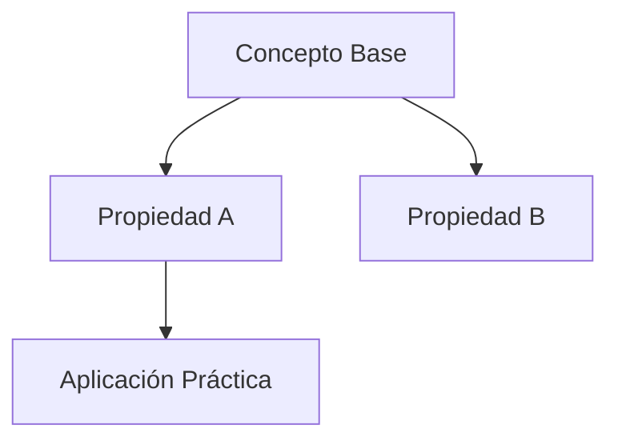
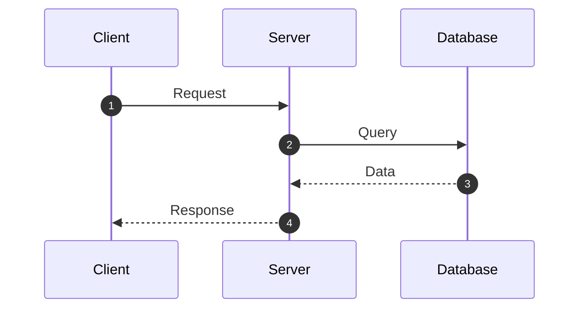

# ada-affinite-note (AFFiNITe BlockSuite Notes Generator)

## Overview
Generates high-fidelity academic, mathematical, scientific, and software engineering notes formatted in clean GitHub Flavored Markdown (GFM) strictly compatible with **AFFiNITe** and its **BlockSuite** editor engine.

Every note is automatically structured into modular blocks, rendered with pedagogical clarity (Feynman Technique), and saved directly into `~/Documents/Affinite_Notes/<Categoria>/` ready for immediate import via **Import → Markdown files (.md)** in AFFiNITe.

---

## When to Use
- User asks: *"haz una nota para affinite sobre [tema]"*
- User asks: *"crea una nota de affinite de [problema matemático / física / software / etc.]"*
- User asks: *"genera apuntes para affinite de [concepto o materia]"*
- Need to produce structured study notes with LaTeX math equations, Mermaid diagrams, callouts, and code blocks for AFFiNITe.

When NOT to use:
- Generating internal codebase changes or bugfixes for the AFFiNITe repository itself (use `ada-code`, `ada-plan`, etc.).
- Simple conversational Q&A without requesting note files.

---

## Target Directory Structure

All notes are saved into the user's local notes directory:
```
~/Documents/Affinite_Notes/
├── Matematicas/            # Precálculo, Álgebra Lineal, Lógica, Cálculo, Probabilidad
├── Ciencias_Fisica/        # Física Clásica, Termodinámica, Electromagnetismo, Mecánica
├── Ingenieria_Software/    # Arquitectura, Algoritmos, Redes, Linux, Docker, Rust, React
├── Investigacion/          # Metodología, Estado del Arte, Papers, Resúmenes Académicos
└── General/                # Planes de estudio, proyectos personales, productividad
```

---

## BlockSuite Block Matrix & Syntax Rules

AFFiNITe parses markdown into native BlockSuite blocks. Follow these exact syntax standards:

| Bloque en AFFiNITe | Sintaxis Markdown Estricta | Ejemplo / Uso |
| :--- | :--- | :--- |
| **Título de Página** | H1 `# Título` (Único al inicio) | `# Diagonalización de Matrices y Valores Propios` |
| **Metadatos & Tags** | Cita / Cursiva bajo el título | `> 📅 **Fecha**: YYYY-MM-DD \| 🏷️ **Categoría**: #matematicas #algebra-lineal` |
| **Callout / Alerta** | `> [!TIPO]` | `> [!NOTE]`, `> [!TIP]`, `> [!IMPORTANT]`, `> [!WARNING]` |
| **Fórmulas Centradas** | Bloque `$$ ... $$` | `$$\det(A - \lambda I) = 0$$` (compatible con KaTeX) |
| **Fórmulas Inline** | `$ ... $` | `Sea $\lambda \in \mathbb{R}$ el valor propio asociado a $v$.` |
| **Diagramas / Grafos** | Bloque ````mermaid ```` | Mapas conceptuales, diagramas de flujo, arquitecturas de software |
| **Tablas de Datos** | Tablas Markdown GFM | `\| Variable \| Significado \| Unidad \|` con separadores `\|:---\|:---\|` |
| **Bloques de Código** | Fenced blocks con lenguaje | ````python ````, ````rust ````, ````cpp ````, ````bash ```` |
| **Checklists** | `- [ ]` y `- [x]` | Lista interactiva para repaso activo y ejercicios |
| **Citas & Teoremas** | `> Texto` con negrita | `> **Teorema Fundamental**: Toda matriz simétrica real...` |

---

## Plantillas de Estructura por Dominio

### 1. Dominio Matemático & Científico (Precálculo, Álgebra, Física)
```markdown
# [Nombre del Tema / Teorema / Problema]
> 📅 **Fecha**: YYYY-MM-DD | 🏷️ **Tags**: #[categoria] #[subtema]

> [!NOTE]
> **Idea Central en 2 Oraciones**: Resumen conceptual sin tecnicismos innecesarios.

## 1. Fundamentos Teóricos & Definición Formal
- Explicación intuitiva (Feynman Technique).
- Definición rigurosa con fórmulas en LaTeX:
  $$\text{Ecuación Principal}$$

## 2. Propiedades & Teoremas Clave
- **Propiedad 1**: Detalle con fórmula inline $x \in \mathbb{R}$.
- **Demostración / Intuición Geométrica**:
  > [!TIP]
  > Explicación del porqué funciona geométricamente o analíticamente.

## 3. Ejercicios Resueltos Paso a Paso
### Problema 1: [Enunciado Claro]
1. **Paso 1: Identificación de variables y planteamiento**:
   $$...$$
2. **Paso 2: Desarrollo algebraico**:
   $$...$$
3. **Paso 3: Resultado e interpretación**:
   > [!IMPORTANT]
   > **Solución**: $\text{Resultado final}$ con conclusión física/matemática.

## 4. Mapa Conceptual


## 5. Checklist de Repaso Activo (Active Recall)
- [ ] ¿Puedo explicar la diferencia entre X e Y sin ver mis notas?
- [ ] ¿Puedo resolver el problema 1 desde cero en papel?
- [ ] ¿Entiendo el significado geométrico de la fórmula?
```

---

### 2. Dominio Técnico & Software (Arquitectura, Sistemas, DevOps, Algoritmos)
```markdown
# [Título del Sistema / Protocolo / Algoritmo]
> 📅 **Fecha**: YYYY-MM-DD | 🏷️ **Tags**: #ingenieria #devops #backend

> [!NOTE]
> **Propósito del Sistema**: Descripción clara del problema que resuelve y su arquitectura base.

## 1. Arquitectura & Flujo de Datos


## 2. Componentes & Especificaciones
| Componente | Rol en el Sistema | Tecnologías / Algoritmos |
| :--- | :--- | :--- |
| **Engine** | Procesamiento central | Rust / Tokio |
| **Storage** | Persistencia local | SQLite / CRDT |

## 3. Implementación & Código de Referencia
```python
def ejemplo_implementacion():
    # Código limpio, comentado y funcional
    pass
```

## 4. Consideraciones de Rendimiento & Errores Comunes
> [!WARNING]
> Cuidado con [error común o cuello de botella].

## 5. Checklist de Verificación
- [ ] Compila y pasa los tests unitarios.
- [ ] Verificado en entorno local.
```

---

## Procedimiento de Ejecución al Invocar la Skill

1. **Analizar el Tema**: Identificar si pertenece a Matemáticas, Física, Ingeniería, Investigación o General.
2. **Determinar la Ruta de Guardado**:
   - `~/Documents/Affinite_Notes/<Categoria>/<nombre-en-kebab-case>.md`
3. **Generar la Nota**: Aplicar la plantilla correspondiente con máximo rigor pedagógico, fórmulas LaTeX completas, diagramas Mermaid y Callouts.
4. **Guardar el Archivo**: Utilizar `write_to_file` para escribir el archivo directamente en la ruta especificada.
5. **Respuesta al Usuario**:
   - Notificar que la nota ha sido creada.
   - Proporcionar la ruta absoluta en un enlace markdown clicable: `[nombre_nota.md](file:///home/rousseau/Documents/Affinite_Notes/.../nombre_nota.md)`.
   - Dar una instrucción breve: *"Para importarla en AFFiNITe: Abre AFFiNITe → Menú Import → Markdown files (.md) → Selecciona el archivo."*
