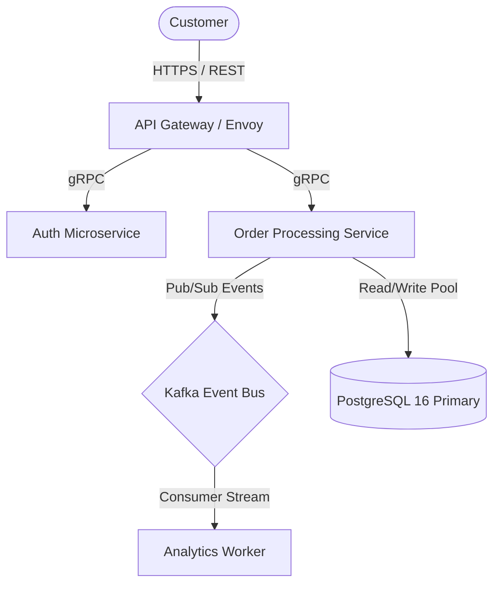

# ada-arch (System Design, C4 Modeling & Architectural Decision Records)

## 1. The C4 Architecture Modeling Standard
When architecting systems, describe them across 4 zoom levels:
1. **Level 1: System Context Diagram**:
   - High-level view showing users, external systems, and boundary interfaces.
2. **Level 2: Container Diagram**:
   - High-level technical layout: Web apps, API Gateways, databases, message brokers, caching nodes.
3. **Level 3: Component Diagram**:
   - Internal modular breakdown of a container (controllers, domain services, repositories).
4. **Level 4: Code Diagram**:
   - Class diagrams, interface definitions, or state machines for critical subsystems.



## 2. Distributed System Design Patterns & Trade-offs
1. **Resilience & Fault Tolerance**:
   - **Circuit Breaker**: Trip to fallback when downstream error rate $> threshold$.
   - **Idempotency**: Require unique idempotency keys on mutation endpoints to handle network retries safely.
   - **Saga Pattern (Choreography vs Orchestration)**: Manage distributed transactions across microservices without 2PC blocking locks.
2. **Consistency vs Availability (CAP / PACELC)**:
   - For transactional financial data $\implies$ CP (Strong Consistency, Raft/Paxos).
   - For high-volume social feed or telemetry $\implies$ AP (Eventual Consistency, CRDTs).

## 3. Architectural Decision Record Template (`ADR-000.md`)

```markdown
# ADR-001: [Decision Title, e.g., Adoption of Event Sourcing for Ledger]

## Status
[Proposed | Accepted | Superseded by ADR-XXX | Deprecated]

## Context & Problem Statement
- What technical challenge or business constraint are we solving?
- What are the throughput, latency, and compliance requirements?

## Decision Drivers
- Performance ($< 10\text{ms}$ write latency).
- Immutable audit trail requirement.
- Team operational familiarity.

## Considered Options
1. Option 1: Relational CRUD updates with trigger-based audit table.
2. Option 2: Event Sourcing with Apache Kafka + PostgreSQL projection tables.

## Decision Outcome & Rationale
Chosen Option: **Option 2**.
Because it guarantees zero data mutation, provides full auditability, and decouples analytics projections from the write path.

## Consequences & Trade-offs
- **Positive**: Complete historical replay capability, horizontally scalable consumer projections.
- **Negative**: Increased complexity in handling schema evolution and eventual consistency on read models.
```

## Checklist for Architecture Reviews

- [ ] System described using standard C4 model diagrams.
- [ ] Single points of failure (SPOF) identified and mitigated with redundancy/failover.
- [ ] Formal ADR written documenting context, rejected alternatives, and trade-offs.
- [ ] Data consistency model explicitly stated (Strict vs Eventual).
