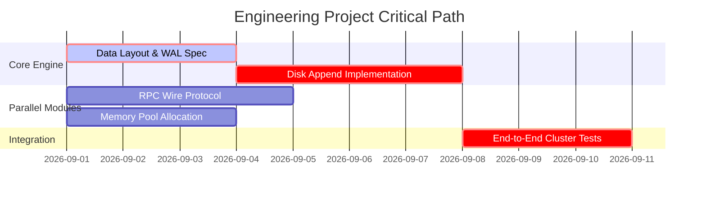

# ada-breakdown (Engineering Project Decomposition & WBS)

## 1. Work Breakdown Structure (WBS) Hierarchy
Decompose engineering deliverables into 4 strict hierarchical tiers:
1. **Level 1: System / Deliverable Objective** (e.g., *Fault-Tolerant Distributed Storage Engine*).
2. **Level 2: Subsystems / Architectural Layers** (e.g., *Storage Engine, Consensus Layer, Network RPC, Client SDK*).
3. **Level 3: Work Packages** (e.g., *WAL Append Pipeline, Compaction Routine, Raft Leader Election*).
4. **Level 4: Atomic Tasks (Verifiable & Testable)**:
   - Each task must have a single clear owner, unambiguous definition of done (DoD), and specific verification test suite.
   - Max task duration: 2-8 focused hours. If larger, break down further.

## 2. Dependency Mapping & Critical Path (CPM / PERT)
1. **Dependency Categorization**:
   - **FS (Finish-to-Start)**: Task B cannot begin until Task A completes (Hard blocker).
   - **SS (Start-to-Start)**: Task B can proceed in parallel once Task A starts.
   - **Independent**: Can be dispatched immediately to isolated subagents or parallel developers.
2. **Critical Path Analysis**:
   - Identify the longest sequence of dependent tasks determining the minimum delivery timeline.
   - Guard against bottleneck tasks on the critical path with early spikes and proof-of-concept prototypes.



## 3. Technical Risk Matrix & Contingency Allocation
Evaluate high-uncertainty components before scheduling:
| Risk Item | Impact (1-5) | Probability (1-5) | Severity | Mitigation Strategy | Contingency Plan |
| :--- | :--- | :--- | :--- | :--- | :--- |
| Driver incompatibility | 5 | 3 | 15 (High) | Mock abstraction layer | Hardware fallback mode |
| Serialization bottleneck | 4 | 2 | 8 (Med) | Zero-copy Cap'n Proto | Dynamic buffer scaling |

## 4. Engineering Roadmap Template (`PROJECT_ROADMAP.md`)

```markdown
# Project Breakdown: [Project Name]

## 1. System Scope & Out-of-Scope Boundaries
- **In-Scope**:
- **Explicitly Out-of-Scope**:

## 2. Work Breakdown Structure (WBS)
### Subsystem A: [Name]
- [ ] Task A.1: [Atomic Task Name] `[Est: 4h]` `[Deps: None]` `[Verif: unit test]`
- [ ] Task A.2: [Atomic Task Name] `[Est: 6h]` `[Deps: Task A.1]` `[Verif: integration test]`

## 3. Critical Path & Parallel Streams
- **Critical Path**: Task A.1 -> Task A.2 -> Task B.3 -> Release
- **Parallel Stream 1**: Subsystem C (independent)

## 4. Milestone Gates
- **Milestone 1 (MVP Spike)**: [Exit Criteria]
- **Milestone 2 (Feature Complete)**: [Exit Criteria]
- **Milestone 3 (Hardening & Benchmarks)**: [Exit Criteria]
```

## Checklist for Project Breakdown

- [ ] Every atomic task has an empirical verification criterion (automated test).
- [ ] Critical path clearly identified with dependency graph.
- [ ] Independent tasks isolated for parallel subagent execution.
- [ ] Risk matrix established with explicit fallback contingencies.
