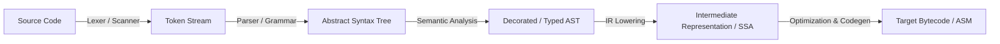

# ada-compiler (Compilers, Automata & Formal Language Engineering)

## 1. The Chomsky Hierarchy & Automata
| Level | Grammar Type | Automaton Model | Practical Use Case |
| :--- | :--- | :--- | :--- |
| **Type-3** | Regular | Deterministic / Nondeterministic Finite Automata (DFA / NFA) | Lexical Analysis (Lexers, Regex) |
| **Type-2** | Context-Free | Pushdown Automata (PDA) | Syntax Analysis (Parsers, ASTs, JSON) |
| **Type-1** | Context-Sensitive | Linear Bounded Automata (LBA) | Type checking with scope validation |
| **Type-0** | Unrestricted | Turing Machine | General Purpose Programming Languages |

## 2. Compiler Pipeline Architecture


## 3. Recursive Descent Parsing Standard
Implement parsers using predictive recursive descent with explicit operator precedence climbing (Pratt Parsing):

```typescript
type Token = { type: 'NUMBER' | 'PLUS' | 'STAR' | 'EOF'; value: string };

class Parser {
  private pos = 0;
  constructor(private tokens: Token[]) {}

  private peek(): Token { return this.tokens[this.pos] || { type: 'EOF', value: '' }; }
  private consume(type: Token['type']): Token {
    const token = this.peek();
    if (token.type !== type) throw new Error(`Expected ${type}, got ${token.type}`);
    this.pos++;
    return token;
  }

  // Primary: Number | '(' Expression ')'
  private parsePrimary(): { type: string; value: number } {
    const token = this.consume('NUMBER');
    return { type: 'Literal', value: parseFloat(token.value) };
  }
}
```

## 4. Intermediate Representation & Static Single Assignment (SSA)
1. **SSA Invariant**: Every variable is assigned exactly once, simplifying data-flow optimizations.
2. **$\phi$-functions**: Placed at control-flow merge points (join nodes) to resolve conflicting variable versions across branches.
3. **Dead Code Elimination & Constant Folding**: Perform optimizations directly on the SSA graph before emitting machine instructions.

## Checklist for Compilers & DSLs

- [ ] Grammars unambiguous without shift/reduce or reduce/reduce conflicts.
- [ ] Error reporting provides line numbers, column offsets, and contextual source snippets.
- [ ] AST nodes strictly typed with immutable properties.
- [ ] Operator associativity and precedence tables explicitly defined.
