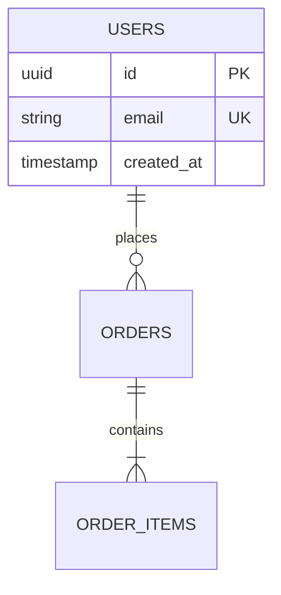

# ada-db (Database Architecture & SQL Engineering)

## Database Design & Normalization Rules

1. **Schema Normalization**:
   - Adhere to 3NF (Third Normal Form) for OLTP transactional databases to prevent data duplication and update anomalies.
   - Use dimensional modeling (Star/Snowflake schema) for OLAP analytical databases.
2. **Reversible Migrations (UP / DOWN)**:
   - NEVER execute ad-hoc schema changes directly on production databases.
   - ALWAYS write reversible migration scripts containing both `UP` (apply) and `DOWN` (rollback) statements.
   - Test both `UP` and `DOWN` migrations locally before committing.
3. **Query Tuning & Execution Plans**:
   - Execute `EXPLAIN` or `EXPLAIN ANALYZE` on all non-trivial queries.
   - Look for `Seq Scan` (Table Scans) on large tables and replace them with targeted B-tree, Hash, or GIN indices.
   - Add indices strictly on high-cardinality, frequently filtered (`WHERE`), or joined (`JOIN`) columns. Avoid over-indexing.
4. **Connection Pooling & Safety**:
   - Configure connection pool limits (`min`, `max`, `idleTimeoutMillis`) appropriate to system resources.
   - Always set explicit query timeouts (`statement_timeout`) to prevent hanging locks.
   - Wrap multi-statement operations in strict database transactions with explicit `COMMIT` and `ROLLBACK` handling.

## Visual Schema Modeling

When designing or modifying schemas, present the entity-relationship model using Mermaid ERD syntax:

## Checklist for Database Changes

- [ ] Schema normalized (1NF-3NF for OLTP).
- [ ] Both `UP` and `DOWN` migration files written and tested.
- [ ] Primary keys use UUIDs or auto-incrementing bigints.
- [ ] Foreign key constraints and ON DELETE cascades explicitly declared.
- [ ] Query performance verified via `EXPLAIN ANALYZE` (no accidental sequential scans on large tables).
- [ ] Transaction boundaries wrapped with `BEGIN`/`COMMIT`/`ROLLBACK`.
